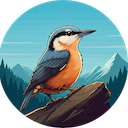

<!--
Copyright (c) 2024 Thomas Mikalsen. Subject to the MIT License 
-->
Tom Mikalsen
============

About me
--------
In my professional life, as a **Senior Technical Staff Member** (STSM) at **IBM**,
I am recognized as an accomplished Software Engineer, Technical Team Leader, and committed Mentor,
with broad software engineering and programming skills, and a history of
delivering high-quality, highly-available systems at scale with demanding
security and compliance requirements. I also have a strong track-record of
innovation at **IBM Research**, including major contributions to the
technology that underpins IBM's Cloud, PaaS, SaaS, and middleware products and
strategy (and [20 US patents](./patents.md) and [30 papers/publications](./pubs.md).)

But there's another side to me... 

&emsp; **I am a lifetime learner and programmer at heart!**

This need to learn fuels my professional success. But more importantly, it
drives me to pursue personal projects and explore technology and skills that are
not immediately required for my day job:

 

[ 
*Codework*](https://www.codework.us/) - Modern tools for a cutting-edge Computer Science classroom.

 

[ 
**Wanderlog**](./wanderlog/wanderlog.md) - AI assisted outdoor activity logging.  <i>For those who wander ... but are not necessarily lost!</i>

 

[ 
**Gorilla**](https://github.com/tommika/gorilla/blob/main/README.md) - Computer Science workouts, in Go!

 

[ 
**Rattlebox**](https://github.com/tommika/rattlebox/blob/main/README.md) - A GPS Toolbox!

 

[ 
**Nuthatch**](https://github.com/tommika/nuthatch/blob/main/README.md) - A Little Web Socket server (HTTP/1.1) written in C, with really good test
coverage.

 

[ 
**Toast**](https://github.com/tommika/toast/blob/main/README.md) - Experiments writing an Operating System from scratch on Raspberry Pi

 

[ 
**Giraph**](./giraph/giraph.md) - Applications of graph data structures and algorithms.

 

 
**Dolphin** - Open water adventures in Data Science and Machine Learning!

 

Notes
-----

\* Project icon images are AI-generated using [Google Gemini](https://gemini.google.com/)