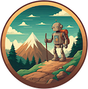

<!--
Copyright (c) 2024 Thomas Mikalsen. Subject to the MIT License 
-->
Tom Mikalsen
============

About me
--------
In my professional life, as a **Senior Technical Staff Member** (STSM) at **IBM**,
I am recognized as an accomplished Software Engineer, Systems Architect and
Technical Team Leader, with broad software engineering and programming skills,
and a history of delivering high-value software products. I also have a strong
track-record of innovation at **IBM Research**, including major contributions to the
technology that underpins IBM's Cloud, PaaS, SaaS, and middleware products and
strategy (plus [20 US patents](./patents.md) and [30 papers/publications](./pubs.md).)

But there's another side to me... 

&emsp; **I am a lifetime learner that loves to hack!** 

This need to learn (and hack) fuels my professional success. But more
importantly, it drives me to pursue personal passion projects and explore
technology and skills that are not immediately required for my day job.  

## What I'm up to ...

[ 
*Codework*](https://www.codework.us/) - Modern tools for a cutting-edge Computer Science classroom.
  

[ * 
**Wanderlog**](./wanderlog/wanderlog.md) - AI assisted outdoor activity logging. 

<i>For those who wander ...  
&emsp; but are not necessarily lost!</i>

 

  * 
**Gorilla** - Some foundational and reusable software written in Go.

 

 * 
**Giraph** - Experiments implementing efficient graph data structures and
algorithms.

 

 * 
**Toast** - Experiments writing an Operating System from scratch on Raspberry Pi
- Preemptive multitasking operating system 
- Basic-terminal I/O
- "Concurrent Euclid"-inspired monitor-based synchronization programming model
- Implemented in C and Assembly (ARM)

 

 * 
**Dolphin** - Open water adventures in Data Science and Machine Learning!

 

Notes
-----

\* Project logo images are AI-generated using [Google Gemini](https://gemini.google.com/)