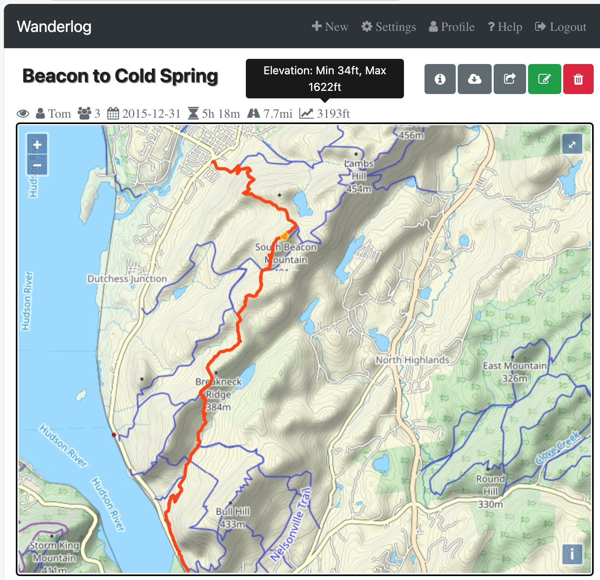
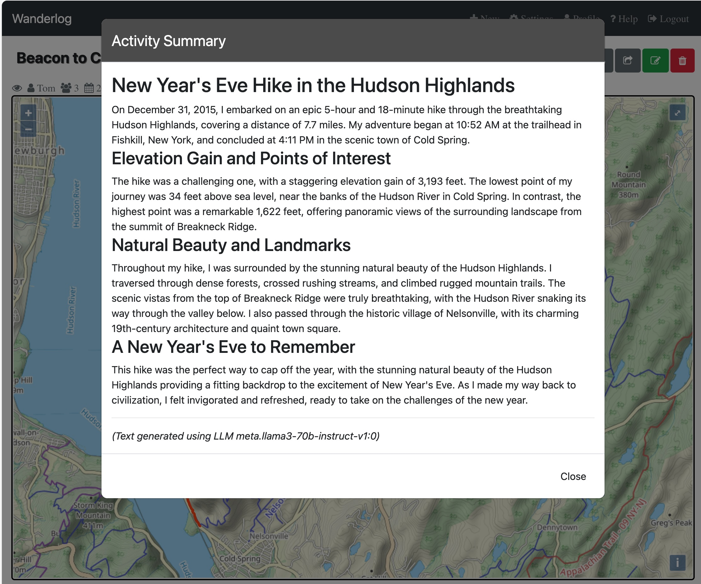
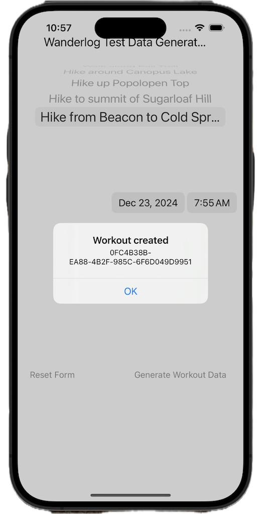
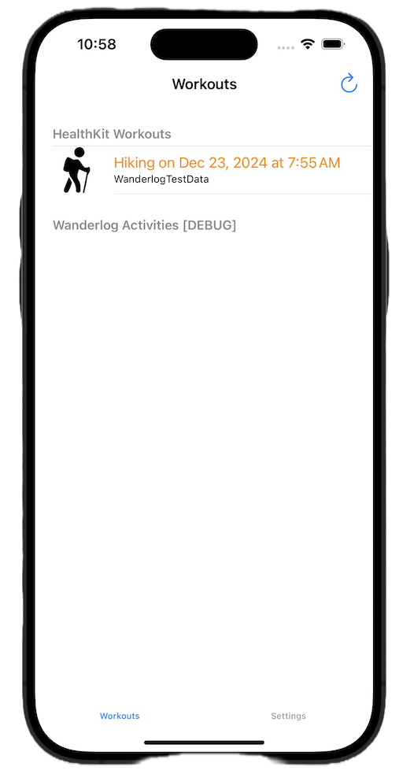
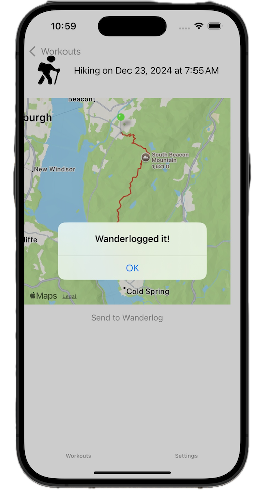
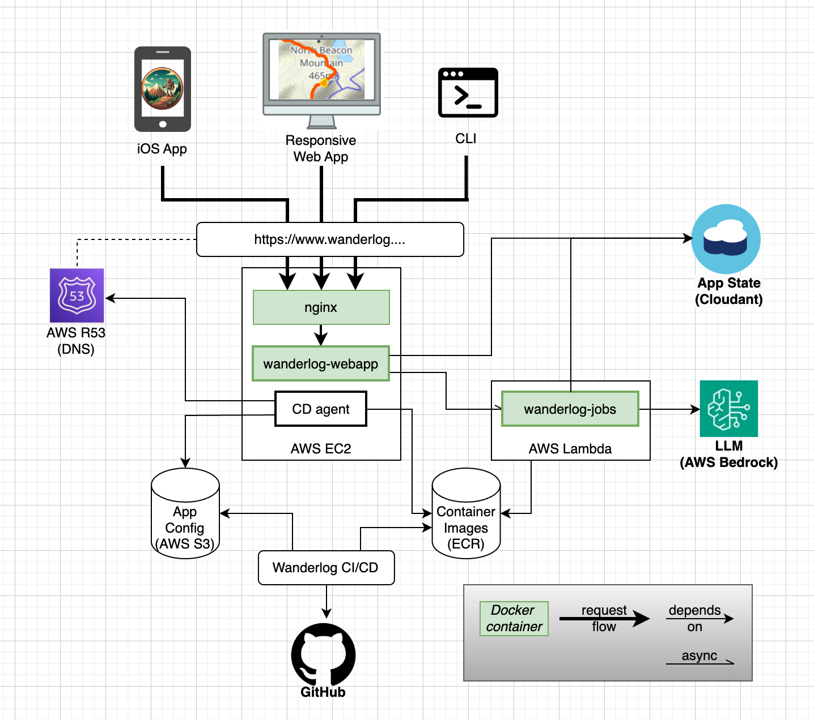

<!--
Copyright (c) 2024 Thomas Mikalsen. Subject to the MIT License 
-->
Wanderlog
=========

 
For those who wander ... but are not necessarily lost!
&dagger;

* Record hiking activities and share the experience, with the help of Generative AI
* Use your mobile device's native activity tracker (e.g., Apple iPhone/Watch
  Workout app) to capture hiking activity data
* The Wanderlog Mobile App sends the activity data, pictures, weather data, etc.
to the Wanderlog Web Service
* The Wanderlog Web Service automatically generates activity narratives from this data

All you have to do is ... *wander*!

## Wanderlog Responsive Web App

> 

Natural-language summary generated from activity data (e.g., GPS data):
> 

## iOS apps
### Test Data Generator
When testing the Wanderlog iOS app in the xCode Simulator, there is a need for 
HealthKit "workout" activity data available on the simulated device.  The
Wanderlog Test Data Generator iOS app allows you to generate this data:
> 

### Wanderlog-sync App
Using the Wanderlog iOS app to synchronize data with the Wanderlog server
> 
> 

Implementation details
----------------------

> 

- Meta's Llama-3 model (AWS Bedrock) automatically generates natural-language activity summaries from GPS data and activity statistics
- Backend APIs, app server and background jobs implemented in Java (w/ SpringBoot, Maven) and leveraging CouchDB/Cloudant, Nginx, Docker 
- Responsive Web app front-end implemented using OpenStreetMap/OpenLayers, JavaScript, Bootstrap, JQuery, DHTML
- Mobile app built for iOS using Objective-C, HealthKit, MapKit
- Command line tools for admin and user scripting/automation
- Hosted on AWS leveraging EC2, Lambda, Route53, and Bedrock LLM service

&dagger; The Wanderlog icon is AI-generated using [Google Gemini](https://gemini.google.com/)

